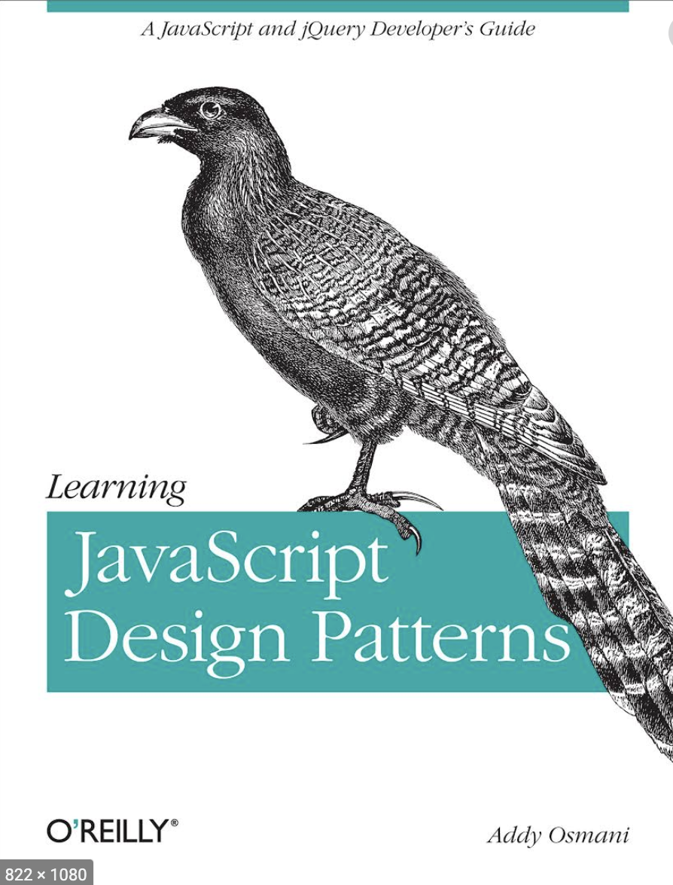
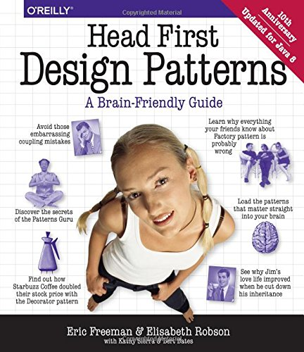
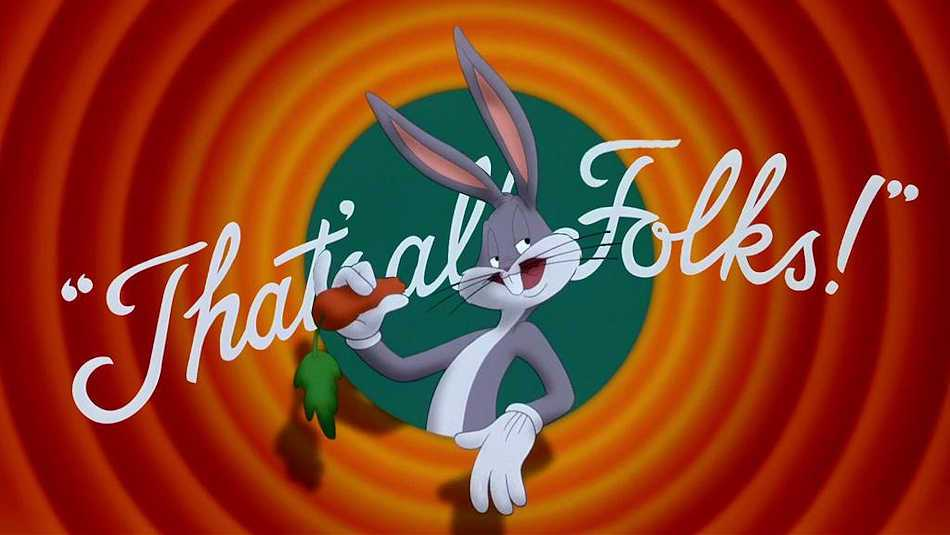

## JavaScript

## **Design Patterns**

@snap[south span-200 text-10]
Autor: *Felix Gündling*
@snapend

---

_„Any application that can be written in JavaScript,
will eventually be written in JavaScript“_

### Atwood’s Law (2007)
---

@snap[west span-30]

@snapend

@snap[midpoint span-30 ]

@snapend

@snap[east span-30]

@snapend

---

@title[Add A Little Imagination]

@snap[span-50 west]

## **_Why & When_**

@snapend

@snap[east span-55]
@ul[list-spaced-bullets text-09]

- To build **maintainable** systems
- To have a shared vocabulary
- In OO-oriented Worlds

@ulend
@snapend


---?image=assets/img/factory.jpg&size=cover&opacity=20

### Creational Patterns

#### (Erzeugungsmuster)

---

@snap[north-east span-100 text-pink text-06]
Set-Up
@snapend

```javascript 
var mySingleton = (function () {
    var instance;
    function init() {
        var privateRandomNumber = Math.random();
        return {
            getRandomNumber: function () {
                return privateRandomNumber;
            }
        };
    }
  return {
      getInstance: function () {
          if (!instance) { instance = init(); }
          return instance;
      },
  };
})();
```

@snap[south span-100 text-gray text-08]
@[1-20]((immediately invoked function expression))
@[11,12, zoom-13](Using GitPitch live code presenting with optional annotations.)
@[13-19, zoom-12](This means no more switching between your slide deck and IDE on stage.)
@snapend

---
@snap[north-east span-100 text-pink text-06]
Test-Drive
@snapend

```js
function getInstanceOfSingleton_1() {
  var singleA = mySingleton.getInstance();
  console.log("Object created. It random number is:");
  console.log(singleA.getRandomNumber());
}

function getInstanceOfSingleton_2() {
  var singleB = mySingleton.getInstance();
  console.log("Object created. It random number is:");
  console.log(singleB.getRandomNumber());
}
```


---?image=assets/img/structural.jpg&size=cover&opacity=20

### Structural Patterns

#### (Strukturmuster)

---

Decorator goes here

---?image=assets/img/Behavioural.jpg&size=cover&opacity=20

### Behavioural Patterns

#### (Verhaltensmuster)

---

Observer goes here

---?image=assets/img/mvc_background_copy.jpg&size=cover&opacity=15

### Compound Patterns

#### (Zusammengesetzte Muster)

---

MVC goes here

---

@snap[text-center]



